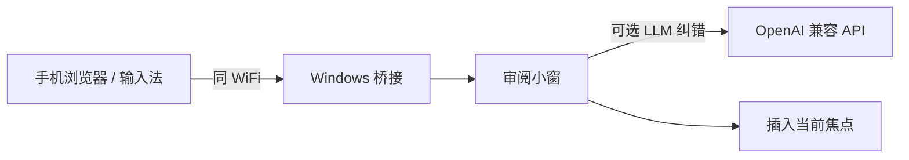

# DoubaoTypeless

**手机当话筒，Windows 当键盘。** 同一 WiFi 下，用手机页语音输入（或豆包输入法语音），文本实时到 PC；小窗审阅后 **一键插入当前光标**——写代码、怼 IDE 聊天、填表单都不用停下手。

可选接入 **任意 OpenAI 兼容 API**（DeepSeek、智谱、MiniMax、Kimi、OpenAI…）做 **前台纠错** 与 **后台学习专名口癖**；**BYOK**，密钥与模型全在你自己手里。

> **非官方**社区项目，与字节跳动及「豆包」产品 **无关联**；名称仅说明常见使用路径。

---

## 为什么值得试

| 痛点 | 这里怎么解 |
|------|------------|
| 长段落手敲打断思路 | 先说完，再在 PC 上改几个字就能发 |
| 不想把语音交给陌生云端 | 桥接在 **你家局域网**；LLM 只在你 **主动配置** 时才参与纠错/学习 |
| 手机输入法语音顺手 | 兼容 **豆包输入法（Android）** 等路径；**不依赖**官方 PC 客户端 |
| 想用自己买的模型 | **OpenAI 兼容 Base URL + Key + Model**，多厂商预设见 `providers.json`，也可走 [LiteLLM](https://github.com/BerriAI/litellm) 统一出口 |

## 和 Vibe Coding 怎么搭

光标停在 **IDE 聊天 / Composer / 终端 / 注释** 里：手机说完 → **PC 小窗确认** → **插入**。这是 **HTTP + WebSocket 桥 + 审阅窗口**，不是 VS Code 插件——因此 **不绑编辑器**，凡能收键盘输入的地方都能用。

## 快速开始

1. **装依赖并启动**（仅 Windows，**Python 3.11+**）  
   `pip install -r requirements.txt` → `python main.py`（或 `scripts/启动.bat`）。
2. **不配 API 也能用**：只做「语音 → 审阅 → 插入」完全没问题。  
3. 首次运行生成 **`config.json`**。托盘 **设置** 里看 **手机访问地址** 或 **扫码**（须同一 WiFi）。
4. 需要纠错/学习时，在设置里填 **Base URL、Key、Model**；字段说明见 **`config.json.example`**，数据默认在 **`data/`**。

**免编译尝鲜：** 直接下 [Releases](https://github.com/aaakoako/DoubaoTypeless/releases/latest) 里的 **`DoubaoTypeless.exe`** 或 **`DoubaoTypeless_win_portable.zip`**。

### 小提示

- 厂商与模型预设见 **`providers.json`**（含推荐 **temperature**；留空时默认 **0.3**）。  
- **勿**把带真实密钥的 `config.json` 提交到 Git（已 `.gitignore`）。  
- 检测局域网 IP 时会向 **`8.8.8.8:80`** 做 UDP connect（不写业务内容）。

## Windows 进阶

- **开机自启**、托盘、日志：可选注册表 Run；打包 exe 无控制台时看同目录 **`debug.log`**，设置里可开日志窗口。正文级日志：`set DT_VERBOSE_LOG=1`（PowerShell：`$env:DT_VERBOSE_LOG=1`）。
- **应用内更新**：单文件 exe 会从 Release 下载并尝试就地替换；若杀软/占用导致失败，请看 **`update.log`**、**`debug.log`**（`[update]`），或保留的 **`_DoubaoTypeless_update_failed.bat`**。更稳的方式是 **完全退出** 后用 **`DoubaoTypeless_win_portable.zip`** 整包覆盖 `DoubaoTypeless` 目录。
- **本地打包**：`pyinstaller --noconfirm DoubaoTypeless.spec`（单文件）；`pyinstaller --noconfirm DoubaoTypeless_portable.spec`（便携目录，再把 `dist/DoubaoTypeless` 打成 zip）。

## 许可证

应用代码 **MIT**（[LICENSE](LICENSE)）。运行依赖以 **`requirements.txt`** 及各包声明为准（含 LGPL 等），分发前请自行评估。

## 声明

个人/社区工具；「豆包」为相关权利人商标，仅说明输入法使用场景。
