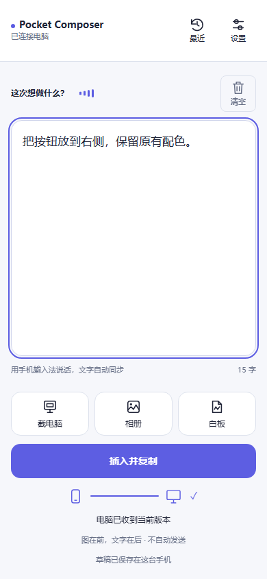
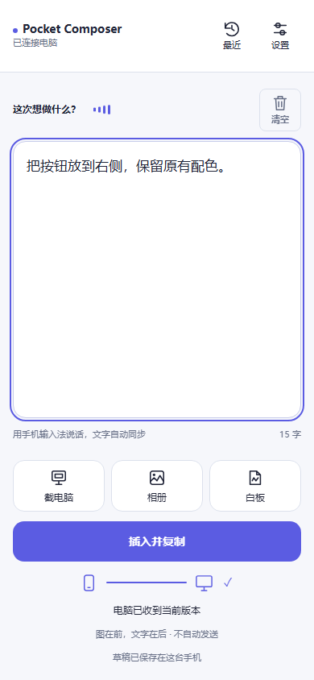

# Pocket Composer
### 手机说清楚，圈出来，画明白。电脑接着做。
**手机到 Windows 的图文输入工具**

[English](README.en.md) · [下载稳定版](https://github.com/aaakoako/DoubaoTypeless/releases/latest) · [安装指南](docs/release/v3-installation.md) · [反馈](https://github.com/aaakoako/DoubaoTypeless/issues)

 

向 Agent 描述界面问题、解释代码需求或画一个布局时，手机往往比键盘更顺手。Pocket Composer 把手机输入法、截图标注和白板放在一起，将整理好的图片与文字插入 Windows 上的目标输入框。

**稳定版：0.5.4。下图展示 0.5.5 体验候选。** [候选说明](docs/release/0.5.5.md) · [稳定版说明](https://github.com/aaakoako/DoubaoTypeless/releases/tag/v0.5.4)

<table><tr><th>手机负责表达</th><th>电脑接着做</th></tr><tr><td align="center"></td><td align="center">  查看、修改、复制、插入。 辅助参考按需展开。</td></tr></table>

## 说清楚，也能画明白

| 你想做什么 | 用哪个入口 |
|---|---|
| 快速说一段需求 | 手机输入法语音输入，仍可手动改字 |
| 指出屏幕上的问题 | **截电脑** → 圈画、箭头、编号、图注 |
| 带上参考图片 | **相册** → 编辑、排序、添加说明 |
| 表达一个布局或想法 | **白板** → 手绘、图形、文字 |
| 放进电脑输入框 | **插入并复制** → 逐图后接文字，默认不发送消息 |
| 继续下一段或找回上一份 | 清空/撤销当前稿，恢复最近图文 |

*实际页面、演示内容；展示编辑与同步，不冒充目标输入框接收结果。语音识别由手机输入法提供。*

## 三步开始

1. **打开电脑客户端**，让手机与电脑接入可互通的可信网络，手机扫码配对。
2. **允许插入并选中目标输入框**，例如你正在使用的 Agent 对话框。
3. **手机输入或加图，点“插入并复制”**。检查电脑里的内容后，再自行发送。

不需要启用模型服务。失败时原稿保留，可复制、手动粘贴或恢复。独立的手机发送功能默认关闭，需要电脑授权和手机明确确认。

## Jev：可选的输入参考

**默认关闭，不影响输入、图片、复制和插入。** 开启后可查看疑似转写问题、四个独立参考维度和文字语气。不打总分、不预测成功率、不强制追问。浮窗只留小标记，完整参考图点开才显示。

*实际 Qt 界面录制，参考与语气为合成示例。火焰是界面彩蛋，不是对真实心理状态的判断。*

Jev 支持 TypeSafe、OpenRouter、Vercel 和兼容自定义接口；纠错/改写模型单独配置。自备 Key 和额度，费用由服务商收取。仅参考当前文字，**不读取目标 Agent 历史或执行结果**。应用动效可单独关闭。

## 下载、数据与兼容性

- [Releases](https://github.com/aaakoako/DoubaoTypeless/releases)提供当前用户安装包和完整便携包；便携包须整体解压。安装文件与既有数据目录沿用 DoubaoTypeless 标识，以兼容已有更新。
- 手机使用浏览器，电脑面向 Windows 10/11。浏览器、输入法和目标应用的兼容性以实际体验为准。
- 已收到 Codex 桌面连续图文插入的用户反馈；**不保证所有输入框都可自动识别**。Cursor、多屏和实体手机输入法仍需进一步验证。
- 草稿、图片和设置本地保存。支持断线续写和重连核对，升级保留工作区，卸载不主动删除草稿。
- 手机桥接用于可信网络；启用模型功能后，相应文字会发送给所选服务商。

[安装、升级与数据](docs/release/v3-installation.md) · [已知限制](docs/release/KNOWN_LIMITS.md) · [隐私说明](docs/PRIVACY.md)

## 开源与商用

[MIT](LICENSE) 允许商业使用、修改和再分发，须保留版权与许可声明。第三方组件保留各自许可证；模型服务有独立条款和费用。

[商用条件 · 中文 / English](docs/legal/COMMERCIAL_USE.md) · [第三方声明](THIRD_PARTY_NOTICES.md)

Pocket Composer 是独立项目，不声称与豆包、字节跳动、OpenAI、Cursor 或模型服务商存在官方合作。

## 参与项目

[反馈问题](https://github.com/aaakoako/DoubaoTypeless/issues)时，请附版本、浏览器/输入法、复现步骤与脱敏截图；不要上传 Key、配对凭据或私人正文。

[构建与验证](docs/release/v3-build.md) · [更新记录](CHANGELOG.md) · [旧版指南](docs/legacy-v0.4.md)
