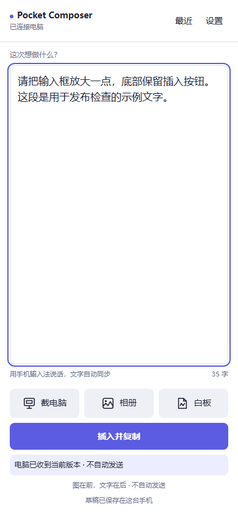
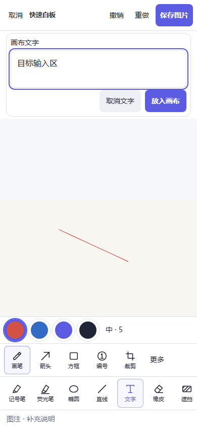
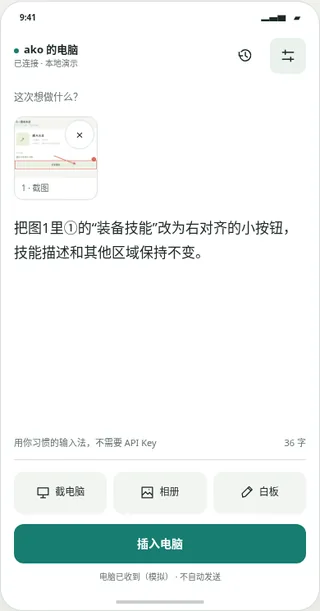
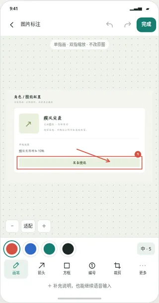
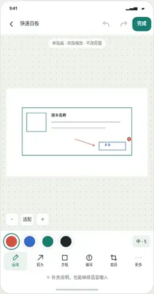

# DoubaoTypeless · Pocket Composer

手机说话、拍图或画白板，把图文放进 Windows 的对话输入框。

**0.5.2 修订中：图文连续输入、完整安装升级和可选输入检查。** 从 [GitHub Releases](https://github.com/aaakoako/DoubaoTypeless/releases) 获取已发布版本。用户已确认 Codex 桌面端连续图文插入；其他输入框、手机浏览器和输入法的兼容性请以实际使用为准。

[安装与使用](docs/release/v3-installation.md) · [构建与验证](docs/release/v3-build.md) · [完整产品计划](docs/v3-product/MASTER_PLAN.md) · [旧版指南](docs/legacy-v0.4.md)

## 当前界面

<table><tr><td></td><td></td></tr></table>

以上是实际生产页面在 Chromium 手机视口中的截图，示例文字与画板为测试内容；不代表实体手机输入法已验收。早期绿色原型保留在下方历史说明中，当前使用蓝紫色方案。

## 日常使用

1. 打开电脑客户端，手机与电脑接入同一网络并扫码配对。
2. 在电脑允许手机插入，点一下目标对话输入框。
3. 手机说话，或从“截电脑、相册、白板”加入图片，点“插入并复制”。内容插入后可以开始下一段，上次图文可恢复。

浮窗支持拖动、常驻置顶、展开后返回、人工阅读时暂停追尾。手机白板提供图标工具、可退出的文字编辑、保存与取消；返回键会处理当前面板和未保存编辑。断线时保留草稿，重新连接后对账。

插入动作不自动发送消息。图片接收结果不确定时保留恢复入口，避免假称成功或重复粘贴。可选 Jev 输入检查提示疑似误字、歧义、缺项及语气，支持 TypeSafe、Vercel、OpenRouter 和兼容自定义接口。纠错与改写模型单独配置；原文输入不依赖模型服务。界面提供输入波形、面板反馈和愤怒火焰彩蛋，可在应用设置关闭。

## 安装、升级与数据

Windows 安装器仅为当前用户安装，提供固定开始菜单入口，保留之前的程序版本。数据保存在独立工作区，升级首次启动前备份；卸载不会删除草稿、图片和设置。具体路径、回退和便携包说明见[安装指南](docs/release/v3-installation.md)。旧预览和 0.4.2 数据不会自动混入新工作区。

仅在可信网络内使用，不要把桥接端口直接暴露到公网。截图需要授权并由明确操作触发；发送给模型仍由用户确认。反馈时请注明电脑版本、手机浏览器及输入法，避免上传私人正文、图片或 API Key。

<details>
<summary>早期 V3 设计与 v0.4.2 发布说明（历史）</summary>

<div align="center">

# DoubaoTypeless

### 说清需求，圈出位置，画出想法。

把手机变成更顺手的 Composer。电脑端按需出现，用完即隐。

[](#v3-开发路线)
[](LICENSE)
[](https://github.com/aaakoako/DoubaoTypeless/releases)

[设计预览](#v3-设计预览) · [下载现有版本](#先使用现有发布版) · [旧版完整指南](docs/legacy-v0.4.md) · [反馈与建议](https://github.com/aaakoako/DoubaoTypeless/issues)

</div>

> [!IMPORTANT]
> **V3 已进入开发。** 下方界面为设计原型，截图、标注、白板与图文投递属于本轮开发目标，不代表现有安装包已经支持。现有发布版为 **v0.4.2**，提供手机到 Windows 的语音文本桥接。这里的 V3 是重构方案代号，**不是已发布的 v3.0.0**；实际交付以 [Release 说明](https://github.com/aaakoako/DoubaoTypeless/releases)为准。

## 手机负责表达，电脑负责插入

写给 Agent 的需求，有时很难只靠键盘说清楚：这个按钮要往哪里移，这一块布局哪里不对，脑子里的界面大概长什么样。

DoubaoTypeless 正在从手机语音文本桥接，升级为一个轻量的图文输入工具：**用熟悉的手机输入法说话，用手指圈画和裁剪，再把处理过的图片与文字放进电脑上的 Composer。** 不用为了画几条线切换专业设计软件，也不需要另买手写板。

不是新的聊天客户端，不是远程桌面，也不是常驻桌面的控制台。

## V3 设计预览

<table>
  <tr>
    <th width="33%">说清需求</th>
    <th width="33%">圈出位置</th>
    <th width="33%">画出想法</th>
  </tr>
  <tr>
    <td align="center"></td>
    <td align="center"></td>
    <td align="center"></td>
  </tr>
  <tr>
    <td align="center">用手机输入法说话，图片和说明放在一起。</td>
    <td align="center">在截图上圈、画、标记，直接指出要改哪里。</td>
    <td align="center">随手画出目标结构，不必追求专业制图。</td>
  </tr>
</table>

*以上为可交互原型的设计截图，含模拟连接状态，并非已发布应用截图。正式界面会随开发与实测调整。*

### 桌面不是主界面，只是短暂出现的浮窗

| 什么时候 | 计划中的桌面表现 |
|---|---|
| 平时不用 | **没有浮窗、悬浮球或常驻面板**；托盘保留低频入口 |
| 手机输入、添图或标注 | 短暂出现的小提示，不抢走正在使用的编辑器焦点 |
| 准备插入 | 显示当前图文摘要与进度；长文不会把窗口撑大 |
| 插入结束或停止活动 | 自动收起，**隐藏不等于丢弃草稿** |
| 需要找回内容 | 主动唤起上次图文，重新确认目标后再插入 |

手机也不做复杂导航：**一个 Composer，三个素材入口——截电脑、相册、白板。** 图片标注和白板共用同一个编辑器，不用在“输入／发送／项目管理”之间来回跳转。

## V3 正在做什么

| 能力 | 本轮方向 |
|---|---|
| **语音输入** | 保留豆包等手机输入法路径，不重新做语音识别；原文不等待 AI |
| **截图与传图** | 在手机请求已授权的电脑截图，或从相册添加图片，直接进入编辑 |
| **快速标注** | 裁剪、圆头笔、记号笔、荧光笔、箭头、形状、编号、文字、撤销与重做 |
| **轻量白板** | 用简单画布和线框图形表达布局、流程与修改意图；包含在本轮范围内 |
| **图文插入** | 明确触发后，先插入处理过的图片，再插入文字；**不按 Enter，不替你发送** |
| **上次图文召回** | 保存图片、顺序和文字；重新选中 Composer 后重试，区分完整重贴与补贴 |
| **可选 BYOK** | 使用自己的 API Key 做手动文字辅助；不配置模型也能使用核心图文流程 |

### 从看到问题，到把想法放进输入框

**截图修改：** 手机点“截电脑” → 裁剪、圈画 → 语音补充说明 → 插入电脑。

**新设计：** 打开白板 → 随手画出结构 → 说明哪些地方保留、哪些地方改 → 插入电脑。

例如，给截图标上①，再附一张草图：

> 图1①是当前的“装备技能”按钮。按图2的草图，把它移到右下角并缩小一点。技能描述、图标和其它区域不要改。

不要求你写一份完整设计文档，也不让 AI 替你猜“这里”“那里”到底指哪里。

### 焦点错了，不用重新整理一遍

V3 会保留最近一次实际尝试插入的**完整图文快照**。修正目标焦点后，可以重新唤起，而不必再截图、画图或重新说一遍。

已经插入部分图片、只差文字时，不应该无差别重贴整份；无法确认接收结果时，先让你选择恢复方式。**发出粘贴按键，不等于目标输入框已经收到。** 不自动清空目标输入框，也不通过重连重放插入操作。

首批重点验证 Windows、Android 手机和 Cursor Agent／Composer；不同应用的图片接收与焦点行为需要分别实测，暂不承诺“任意 Agent 都能自动插入”。

## 先使用现有发布版

**v0.4.2 仍可使用：手机语音输入 → 电脑审阅小窗 → 插入文字。** 此版本不包含上面展示的 V3 图片编辑、白板和图文投递能力。

[下载 Windows 单文件 EXE](https://github.com/aaakoako/DoubaoTypeless/releases/download/v0.4.2/DoubaoTypeless.exe) · [下载 Windows 便携 ZIP](https://github.com/aaakoako/DoubaoTypeless/releases/download/v0.4.2/DoubaoTypeless_win_portable.zip) · [查看 v0.4.2 发布页](https://github.com/aaakoako/DoubaoTypeless/releases/tag/v0.4.2)

1. 启动电脑端，让手机和电脑处于同一可信局域网；从托盘设置查看手机地址或扫码。
2. 在手机网页的输入框里，使用豆包等手机输入法语音输入。
3. 在电脑小窗确认文字后插入。不配置 API 也可以完成这个流程。

<details>
<summary><strong>从源码运行现有版本（Windows / Python 3.11+）</strong></summary>

下面的标签固定到现有发布版，避免将开发分支与 V3 成品混淆：

```bash
git clone https://github.com/aaakoako/DoubaoTypeless.git
cd DoubaoTypeless
git checkout v0.4.2
python -m pip install -r requirements.txt
python main.py
```

旧版的模型配置、词库、连接诊断、自启动、日志、更新和打包命令已保留在[旧版完整指南](docs/legacy-v0.4.md)。

</details>

## V3 开发路线

目前已进入开发；下表是交付顺序，不表示各阶段已经完成。

| 阶段 | 要验证或交付的内容 |
|---|---|
| 技术验证 | 非激活浮窗、真实手机绘画与输入法、真实 Composer 图片接收、焦点修复与恢复 |
| 纯文字体验 | 无 Key 可用、不等 AI、不常驻、可靠同步，保住现有高频使用体验 |
| 手机图文闭环 | 电脑截图、相册、裁剪与标注、先图后文、上次图文召回 |
| 完整表达工具 | 轻量白板、实用笔刷与形状、编号说明、简单引导和可选 BYOK |
| 候选版本 | Windows 便携包、迁移与回退、真实机器和持续使用验收 |

macOS、Linux 与安全的跨网络连接作为后续方向；本轮先把 Windows 日常使用做好。不做持续屏幕直播、协作白板、无限画布或新的模型聊天客户端。

## 隐私与使用边界

输入法的语音处理由你选择的输入法服务负责；DoubaoTypeless 不提供新的语音识别服务。配置模型辅助时，相关文字会发送到你选择的服务商，请自行确认其数据政策。

**同一局域网不等于传输已加密。** 现有版本请仅用于可信的私人网络，不要直接把桥接端口暴露到公网。V3 的设备配对、截图授权与受控插入属于开发范围，不能当作旧版本已经具备的保障。

V3 的截图设计是按明确操作获取已授权画面，不持续截屏；图文投递默认使用处理后的成品图，不自动附带裁剪前的整张截图。最终发送给模型仍由你在目标应用中确认。

## 反馈与贡献

欢迎在 [Issues](https://github.com/aaakoako/DoubaoTypeless/issues) 分享高频场景和使用问题。反馈现有版本故障时，请注明应用版本、系统、手机浏览器及输入法，优先附脱敏诊断；反馈 V3 设计时请注明“V3 设计建议”。**不要上传 API Key、私人截图或敏感输入正文。**

---

应用代码采用 [MIT License](LICENSE)，运行依赖遵循各自许可证。

**非官方社区项目，与字节跳动及「豆包」产品无关联。** 名称仅说明常见输入法使用场景；「豆包」为相关权利人商标。

</details>
